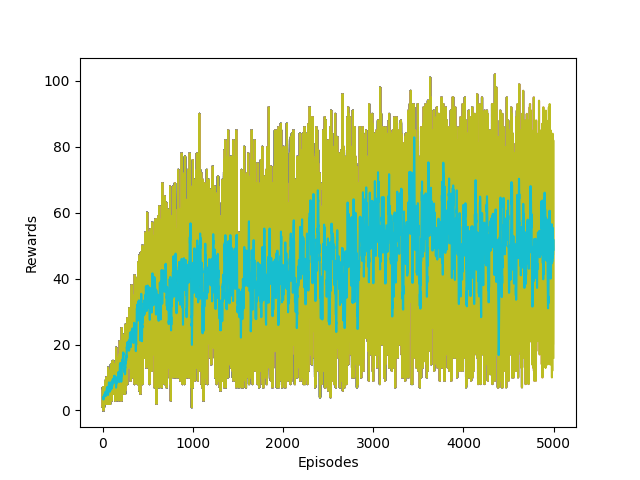

# RL - PowerAgent  
Agent needs to collect resources and build processor where the processor will produce items. Collecting this items gives more reward to the agent.

 

Run `run.py` in `src/RL`. Comment the test function and uncomment the train function. The type parameter takes one of the three values `Atten`, `Default`, `Memory` .  

* `Atten`   - Use Self attention mechanism 
* `Memory`  - Uses GRU
* `Default` - Uses Feed forward net

If you want to train your own model, change the parameters in train function in `run.py`
```
EPISODES = 5000
STEPS = 1000
HIDDEN_SIZE =  64 
MODEL_NAME = "PowerMAgentv2-S7"

PLOT_FILENAME = MODEL_NAME + ".png" 
HIST_FILENAME = MODEL_NAME + ".pkl" 


train( gsize=(14,14),
       vsize=7,
       nactions=6,
       model_name = MODEL_NAME + ".pth", 
       type="Memory",
       load_model = None)
```
Once trained the model, use the test function and change the type to the type of your model and run `run.py`
Training Results for Memory and Attention are given below:




Attention Agent required more time in learning because it can see only 20 frames back in time where Memory Agent can look behind much back.